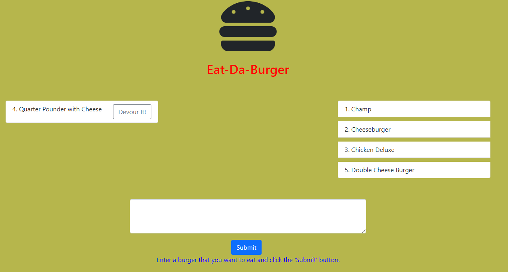

# Team-Profile-Generator

  

  ## Description 
  
  This application is a Burger App that utilize Node.js, MySQL, Express, and Handlebars. This app follows MVC design pattern; it uses Node MySQL to query and route data to app, Handlebars to generate the HTML. The application is deployed in Heroku so I used JawsDB MySQL add-ons to integrate the database in Heroku.

  As part of the requirement for this assignment, I have revised my 'Updated Portfolio' app that now includes link to this application as well as the Github repo.
  
  
  ## Table of Contents
  
  * [Installation](#installation)
  * [Usage](#usage)
  * [License](#license)
  * [Contributing](#contributing)
  * [Tests](#tests)
  * [Questions](#questions)
  
  
  ## Installation
  
  The project requires that express, express-handlebars, and MySQL to be installed. In addition, the dev package nodemon was also installed.
  
  
  ## Usage 
  
  The following image snapshots the functionality of the app.

  

  
  The application could be accessed using the following heroku link:

  https://burgerapp-amm.herokuapp.com/

  The repository for this application could be accessed using the following github link:

  https://github.com/apolinar1607/burger.git

  My Updated Portfolio could be accessed using the following link (modified to include link for this app):
  
  https://apolinar1607.github.io/Updated-Portfolio/

  ## License
  
  Licensed by : [Apache](./utils/license-Apache)
  
  
  ## Contributing
  
  Not applicable.
  
  ## Tests

  To run the application locally, type 'npm run watch' or 'npm start' in the command line inside the folder containing the server.js file.
  
  To deploy it in automatically, use the heroku link provided above.

  ## Questions
  
  Github Username: 
  [apolinar1607](https://github.com/apolinar1607)

  Please send me an email if you have any question(s): 
  apolinar.magtanong@gmail.com
  
  

  ---
  © 2021 JM Automation . All Rights Reserved.

